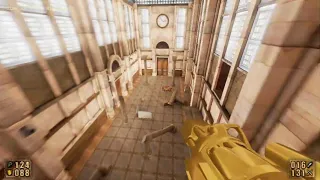

Painkiller multiplayer powered by Unreal Engine 4
---
*Multiplayer game based on "Painkiller" by "People Can Fly", &copy; 2004 &copy; 2005 DreamCatcher Interactive Inc.*

------------
How to build the project:
---
- Build the Unreal Editor from this [repository](https://github.com/EpicGames/UnrealEngine/tree/4.7 "repository")  
	**Before building UE4.sln, replace the source files of the engine with the files from this** [folder](misc/UnrealEngine-4.7 "folder")
- Right click on PK.uproject -> Switch Unreal Engine version... -> select your Source build
- Right click on PK.uproject -> Generate Visual Studio project files
- Build PK.sln

------------
Packaged version (401 MB)
---
[WindowsNoEditor_a1.23.7z](https://drive.google.com/file/d/1R4tMPmE__Oh4tLi3WxzoOu5OKGA1nHTh/view?usp=share_link "WindowsNoEditor_a1.23.7z") (26 March 23)

------------
